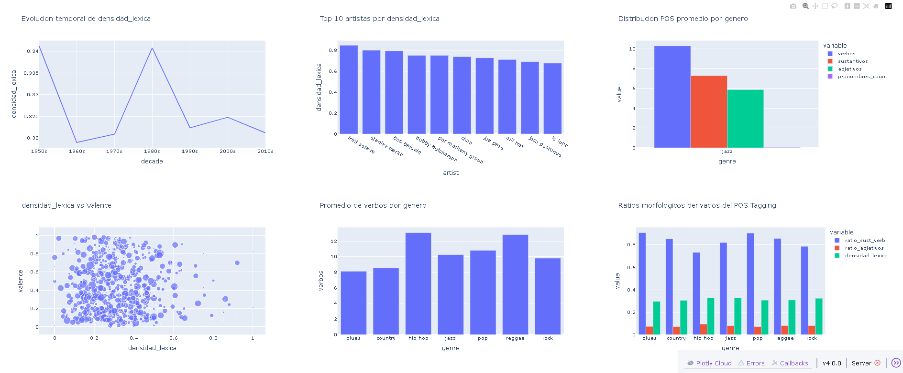
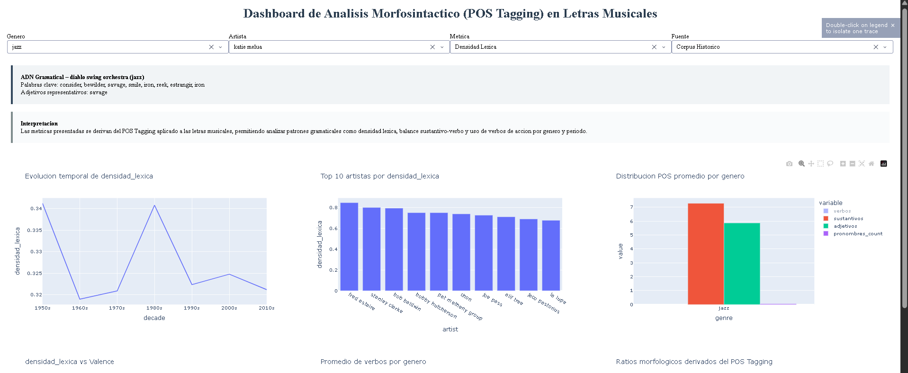

Análisis Morfosintáctico de Letras Musicales con POS Tagging

Comparación NLTK vs spaCy – Patrones por Género y Evolución Temporal

Curso: Técnicas de Minería de Textos y PLN
Institución: Colegio Universitario de Cartago (CUC)
Integrante: Brayton (Jhuler12311)
Profesor: Osvaldo González Chaves
Fecha: Febrero 2025

Objetivo General

Aplicar técnicas de POS Tagging utilizando NLTK y spaCy sobre letras de canciones para:

Comparar sistemas de etiquetado gramatical (Penn Treebank vs Universal POS)

Identificar patrones morfosintácticos por género musical

Analizar la evolución temporal de la complejidad gramatical

Explorar la relación entre estructura gramatical y emocionalidad (valence, sadness, romantic)

Dataset

Fuente: Music Dataset: Lyrics and Metadata from 1950 to 2019 (Kaggle)

Archivo original: tcc_ceds_music.csv

Tamaño original: ~41,000 canciones

Muestreo: 10,000 canciones → limpieza → análisis efectivo ~5,000 letras

Período temporal: Décadas desde 1950s hasta 2010s

Variables relevantes: género, valence, sadness, romantic, danceability, loudness, entre otras

Arquitectura del Pipeline (Reproducible)

El proyecto sigue una arquitectura modular y reproducible, separando claramente cada etapa del procesamiento:
raw → limpieza → análisis lingüístico → métricas → visualización

# 1. Clonar repositorio y crear entorno
git clone https://github.com/Jhuler12311/proyecto-pos-tagging-letras.git
cd proyecto-pos-tagging-letras
python -m venv .venv

# Activar entorno
# Windows
.venv\Scripts\activate
# Linux / Mac
source .venv/bin/activate

# 2. Instalar dependencias
pip install -r requirements.txt

# 3. Descargar modelos spaCy
python -m spacy download es_core_news_sm
python -m spacy download en_core_web_sm

# 4. Ejecutar pipeline completo
python src/data/loader.py        # Dataset base + muestreo + décadas
python src/data/cleaner.py       # Limpieza de letras
python src/models/analyser.py    # POS Tagging + métricas lingüísticas
python src/models/comparison.py  # Métricas léxicas complementarias

# 5. Lanzar dashboard interactivo
python src/visualization/dashboard.py
# Abrir en navegador: http://127.0.0.1:8050/

Metodología de Análisis
POS Tagging

spaCy: Universal POS (pipeline principal)

NLTK: Penn Treebank (comparación conceptual y experimental)

Se utilizan métricas como:

Conteo de verbos, sustantivos, adjetivos y pronombres

Densidad léxica

Ratio sustantivos/verbos

Ratio de adjetivos

Lemas y adjetivos representativos por canción

El pipeline soporta corpus bilingüe (es/en) mediante detección simple de idioma por letra.

Resultados Principales
Comparación NLTK vs spaCy

spaCy es significativamente más rápido en procesamiento por canción

Penn Treebank (NLTK) es más granular para inglés

Universal POS (spaCy) es más consistente para corpus multilingüe

Decisión técnica:
spaCy se utiliza como herramienta principal por su rendimiento y adaptabilidad a letras mixtas (español/inglés).

Patrones por Género

Hip-Hop: mayor promedio de verbos → narrativa activa y dinámica

Baladas: mayor carga emocional → más adjetivos y pronombres

Pop: alta densidad de adjetivos positivos y uso de segunda persona

Estos patrones pueden explorarse de forma interactiva en el dashboard.

Evolución Temporal

Disminución de densidad léxica en décadas recientes

Mayor uso de pronombres personales en los años 90s y 2000s

Indicios de simplificación gramatical en música contemporánea

Emocionalidad Gramatical

Alta densidad de adjetivos correlaciona con mayor emocionalidad

Uso frecuente de “you” y pronombres en canciones románticas

Visualización del ADN gramatical por artista en el dashboard

proyecto-pos-tagging-letras/
├── data/
│   ├── raw/
│   │   └── tcc_ceds_music.csv
│   └── processed/
│       ├── dataset_final.csv
│       ├── dataset_limpio.csv
│       ├── dataset_master.csv
│       └── dataset_avanzado.csv
├── src/
│   ├── data/
│   │   ├── loader.py
│   │   └── cleaner.py
│   ├── models/
│   │   ├── analyser.py
│   │   └── comparison.py
│   └── visualization/
│       └── dashboard.py
├── notebooks/
│   ├── notebook_analisis_genero.ipynb
│   └── comparacion_nltk_vs_spacy.ipynb
├── requirements.txt
├── USO_DE_IA.md
└── README.md

Requisitos Técnicos

Python: 3.12

Librerías principales:
pandas, numpy==1.26.4, spacy==3.8.11, nltk, tqdm, plotly, dash

Modelos spaCy:
es_core_news_sm, en_core_web_sm

Conclusión

El análisis morfosintáctico de letras musicales permite identificar patrones lingüísticos claros por género y por época.
spaCy se posiciona como la herramienta más robusta para análisis multilingüe de letras, superando a NLTK en velocidad y consistencia.

Los resultados respaldan:

Simplificación gramatical en décadas recientes

Mayor personalización emocional en géneros como Pop y Baladas

Para una exploración completa, se recomienda ejecutar el dashboard interactivo.

Evidencia Visual
()
()